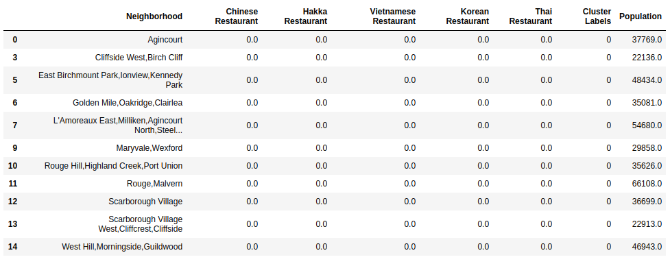

# Location recommendation for business

## 1. Introduction
### 1.1. Background

Office location is always a important factor for any business owner. Not only, with a good location, companies, restaurants can rise the awareness of customers but also could reduce the cost for transportation. However, a good location requires a large rental cost. A good tradeoff between the goodness and price could be a boost for any business. However, the movement of customer usually changing from years to years, seasons by seasons. For example, in the summer, people have tendency to go to the sea. On the other hand, they usually look for a cozy place in downtowns. It is also important to aware about the competitors in the same region. Usually, people with the same business are attracted to the same place. Therefore, it is advantageous to know these information beforehand. This kind of problem could be applied for any city in the world. In this particular project, Toronto was chosen.     

### 1.2. Problem

Data that could help to determine this place include: trending venues in a given street or neighborhood, attractiveness of similar business, rental prices on these neighborhoods (if available). We could also introduce some metrics to measure an attractiveness of given street for this specific business. This project aims for giving a recommendation base on these informations. For demonstration purpose of this project, an business owner which asks for help to decide a location for his/her Asian restaurant in Scarborough.        

### 1.3. Interest

As the name of this report, this project is interested by any business owner, specially a small business such as coffee shops, restaurants which location is critical for their business.

## 2. Data
### 2.1. Data Sources
Most of information about the venues at Toronto could be gathered by Foursquare's data. For example, Foursquare API not only provides the trending venues at a specific location but also gives the similar venues. These kinds of data could be used to determine similar neigborhoods and venues. These factors could be indicators for location selection.      
### 2.2. Data wrangling
Most of the time, Foursquare API could provide very good data given good location information. However, sometime, these information might be missing either by network (in my case) or lacking of information from the database of Foursquare. I will need to remove this kind of missing from my recommendations. It is also good to recommend a place when we have good informations rather than some places that we doesn't has any information. 

Format of data provides from Foursquare API is json. I will need to transform it into a dataframe and quantify these information into numerical format that I could use to compare between the neigborhoods and adding this factor for my location metrics. 

Each neighborhood will have different venues. The atractiveness of a given place will not only depends purely on the number of venues. Therefore, this data need to be normalized to be compared fairly. 

The details of this process will be described after data collection. 

To add more complexion for the recommendation system, data of Toronto population is added with the data of longtitude, latitude of neighborhoods. 

## 3. Methodology

The first components of this system is the dataset about these neighborhoods. This list could be crawled easily from the wikipedia pages of Toronto. However, with this source of data, there are many regions that have postal code but missing the name of borough or neighborhoods. In this kind of projects, a clear information is desired since this is critical for the business. Therefore, to resolve this issues, all the rows that do not have information about borough are removed. With further analysis, we could also observed that many neigborhood are sharing the same code postal. To simplify the data, neighborhoods that share the same postal code are grouped together to make a super neighborhood. After this process, a table of 103 rows are produced. 

With this dataframe, I still cannnot use the Foursquare API to get the venues at a given super neighborhood. The latitude and longtitude are still needed. Geopy package could be a solution for this problem. However, since this package can not be reliable, provided data from IBM is used and merge to the dataframe from the previous step. 

Another factor that is useful for location recommendation is the population for each super neighborhood. Toronto is a large city and provide its data freely on their website. The lastest data about population that could be used is population of 2016. This is not the most up-to-date data. However, with an assumption that the population inside each super neighborhood will not be chaged to quickly from 2016 until now (2020), this data could provide a roughly picture of these regions. When the data is merged into the main dataframe, population of region M7R (postal code) is missing. This neighborhood is a postal office center at the Mississauga borough. Since, this might not be a interested place for business (to small, might have 50 employees max.), we could safely fill this region with population of 50 people. 

From this collected dataset, there are 10 boroughs with 103 super neighborhoods are considered. Visualization of these regions showed that Toronto is a beautiful city on the bord of Lake - Ontario. This is also a border with US, New York state. This is an advantage for any business that has connection to the sea, specialy Asian cuisine but mixed with seafood from Lake Ontario. From the map below of Toronto, we could see that the density of each neighborhood is not homogenious. This hints that probably, the neighborhoods in center of Toronto has denser activity. This might be a factor to decide the business. 

 

In the context of this project, to simplify the process of data analysis, only the neighborhoods that belong to Scarborough are considered. In total, only 16 super neighborhoods are considered for location recommendation. Using Foursquare API, we collected on total 59 different categories of venues on this borough. This kind of venues varies from Stadium, coffee shops, restaurant, commercial, etc. The kind of venues then converted to the one hot coding so that we could use them to represent the properties of each super neighborhood. Some might focus on the entertaiment, some is kind of food neighborhood.

Assume that in this project, an owner would like to open an Asian restaurants with Vietnamese food as main disk. For this purpose, only Asian restaurants are selected here since it will create a big impacts as a competitors. Furthermore, there is a good chance that the customer already know that this neighborhood is famous for Asian foods. That could be an advantage to be considered for location. From the list of venues that is collected from Foursquare, only 5 types of venues are considered: 
'Chinese Restaurant','Hakka Restaurant', 'Vietnamese Restaurant', 'Korean Restaurant', 'Thai Restaurant'. Among these types of venues, Viet, Hakka, Thai restaurant might be quite similar. Chinese and Korean cuisine might be distinct but it highly depends on chef/owner's origin. 

In this dataset, I used a new concept: number of kind of venues per 100K population. Arguably, this is better metric to reflect the market size locally. These feature then is used to cluster this dataset into 5 categories. This will provide a picture with different picture of Asian restaurant in this borough. 

Take a look deeper at what venues is most common for each neighborhood, it is easily to observe which neighborhood is for business and which is for habitants. 

## 4. Results

After clustering, from 16 super neighborhoods, 5 clusters are created with some distince properties. 

For 5 clusters:

### Cluster 1: super neighborhoods that do not have any Asian restaurants

 

### Cluster 2: super neighborhoods that have Korean restaurants.

 

### Cluster 3: super neighborhoods that have Hakka and Thai restaurants

 

### Cluster 4: super neighborhoods that have Chinese and Vietnamese restaurants

 

### Cluster 5: super neighborhoods that have Chinese restaurants with(out) Thai restaurants

 

## 5. Discussion
From the analysis with the population per neighborhood, we could observe that the number of Asian restaurants are still under populated on those regions. Therefore, there are still many opptunities for business owners that would like to open an Asian restaurants. 

However, if the business owner, would like to maximize the probability of success, Rouge,Malvern is recommended for lacking of Asian restaurants in those regions and have large population.

Obviously, this is very simple model. To make real impact recommendation, more data would be needed to create a accurate model such as population density, the rate of comeback for customers, users ratings, etc. 

From the representation's perspective, a good clustering proved that the feature number of venues per 100K is effective to represent the feature of these super neighborhood. 

## 6. Conclusion
This capstone project are an proved that by using a simple method such as clustering, with good methodology and data, we could observe quite clear picture about the similarity and differences between each regions. This kind of observation could be the key idea and brings many benefits for business and bring impact for business owner as this project showed. 

On the otherhand, since this project is quite short and lack of funding, a complicated model with richer representation could not be developed. In real business, I could propose some richer information such as the customer return rate of client for each venues, the revenues of each restaurant. This could provide the better picture about the disadvantage and advantage for each location. This will allow the owner make better decision.  

